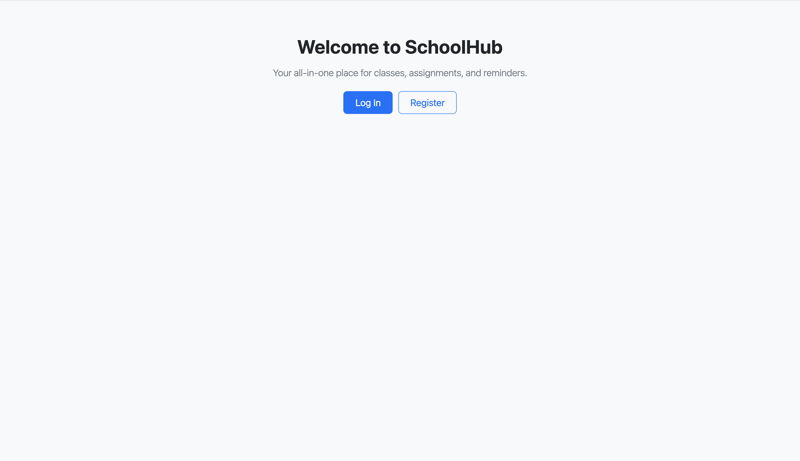
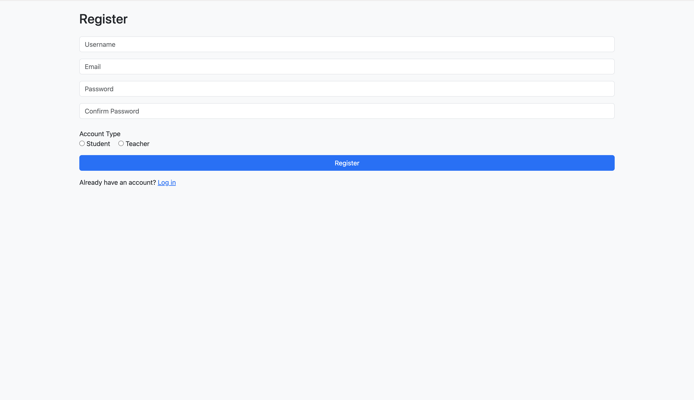
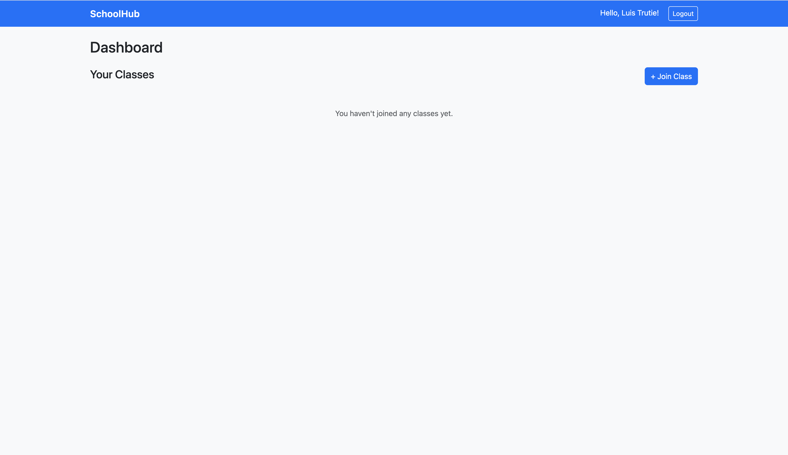
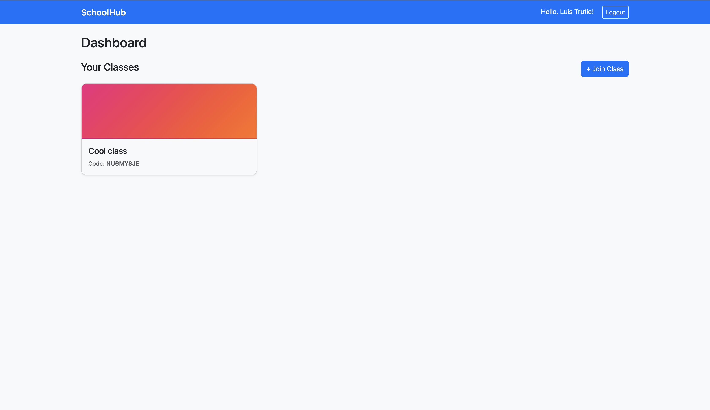

# SchoolHub

**SchoolHub** is a full-stack web application built with Django to help schools organize and manage academic assignments in a centralized platform. It allows teachers to publish homework and tasks while giving students a clean, structured interface to view their assignments in one place. This project was developed independently as the final capstone for **CS50’s Web Programming with Python and JavaScript (CS50W)** and is designed as a practical, production-style web application rather than a demonstration project.

---

## Features

- **User Authentication:** Secure login and registration using Django’s authentication system with role-based separation between teachers and students.
- **Assignment Management:** Teachers can create and publish assignments; students can view all assigned work in a centralized dashboard.
- **Structured Data Model:** Relational database design using Django ORM with persistent storage for users, assignments, and related entities.
- **Dynamic Frontend:** Django templates combined with JavaScript for interactivity and a responsive layout for usability across devices.
- **Static & Media Handling:** Organized static assets (CSS/JavaScript) and support for uploaded media where applicable.

---

## Live Demo

**URL:** https://schoolhub-xoua.onrender.com 

*(Hosted on a free tier. The site may take a few seconds to load after inactivity.)*

---

## Screenshots

### Landing Page


### Registration


### Student Dashboard (No Classes)


### Student Dashboard (With Class)


---

## Technical Overview

SchoolHub is built as a full-stack web application with clear separation between backend logic, database models, and frontend presentation. The backend uses Django with custom models, migrations, authentication, and clean URL routing. The frontend uses Django templates with JavaScript for client-side interactivity and a mobile-responsive layout. The project architecture is modular, maintainable, and designed with scalability in mind.

---

## Project Structure

```text
SchoolHub/
│
├── manage.py              # Django management script
├── schoolhub/             # Project configuration (settings, URLs, WSGI/ASGI)
│
├── core/                  # Main application logic
│   ├── models.py          # Database models
│   ├── views.py           # Request-handling logic
│   ├── urls.py            # URL routing
│   └── templates/         # HTML templates
│
├── static/                # CSS and JavaScript files
├── media/                 # Uploaded media files
└── requirements.txt       # Python dependencies
```

---

## Installation & Setup

### Requirements
- Python 3.x
- Django

### Steps

1. **Clone the repository**
   ```bash
   git clone https://github.com/wishopro/SchoolHub.git
   cd SchoolHub
   ```

2. **Create and activate a virtual environment**
   ```bash
   python -m venv venv
   source venv/bin/activate   # macOS/Linux
   venv\Scripts\activate      # Windows
   ```

3. **Install dependencies**
   ```bash
   pip install -r requirements.txt
   ```

4. **Apply database migrations**
   ```bash
   python manage.py migrate
   ```

5. **Run the development server**
   ```bash
   python manage.py runserver
   ```

6. **Open in your browser**
   ```
   http://127.0.0.1:8000/
   ```

---

## Project Context

SchoolHub was developed independently as the final project for **CS50W**. All code was written specifically for this application and does not reuse implementations from earlier course assignments. The project emphasizes real-world application structure, backend data modeling, authentication and access control, frontend integration, and full-stack system design.

---

## Tech Stack

- Python  
- Django  
- JavaScript  
- HTML/CSS  
- SQLite (development)

---

## Future Improvements

- Role-based permissions (admin, teacher, student)  
- Assignment deadlines and notifications  
- File uploads for submissions  
- REST API for mobile integration  

---

## License

This project is licensed under the **MIT License**. See the `LICENSE` file for details.
